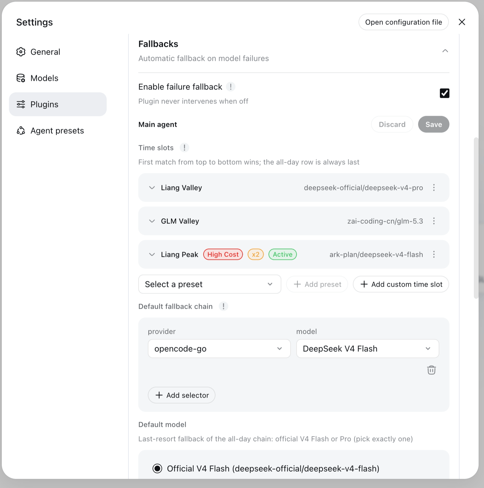

# dsh-llm-fallbacks

[English](README.md) | [中文](README.zh-CN.md)

[](LICENSE)


[](https://dshfind.com/zh/plugins/omdsh-dev/dsh-llm-fallbacks?ref=badge)

Automatic provider/model fallback chains for dsh (DeepSeek Harness): when an agent's LLM requests keep failing — retries exhausted, auth errors, quota exceeded, rate limiting (429) — the plugin switches provider/model along the fallback chain for the current role, and the current step/turn continues on the target model: tasks are not interrupted by model problems.

Works in both dsh front ends: the **web** profile (Settings → Plugins → Fallbacks card) and the **dsh-tui** terminal profile (`/fallbacks` + `/fallbacks config`).

## Time slots

Time slots rotate the **effective root chain** by wall-clock windows: each slot row carries its own fallback chain, and the first row whose window contains the current moment replaces the all-day chain for the next root request — the all-day chain stays as the last resort when no slot matches. Peak and valley windows can therefore use different chains while the failure walk (fallback switch) remains untouched.



Four frozen UTC+8 presets (windows are code constants; preset rows lock `tz` to Asia/Shanghai):

| Preset | Window |
|---|---|
| `liang-peak` | 09:00–12:00 and 14:00–18:00, every day |
| `liang-valley` | every other UTC+8 time (complement of Liang Peak) |
| `glm-peak` | Monday–Friday 14:00–18:00 |
| `glm-valley` | every other time (complement of GLM Peak) |

GLM Peak and GLM Valley are offered in the card picker only when `zai-coding-cn` is configured.

The first extra row whose window contains the current moment (in `fallbacks.tz`, default Asia/Shanghai) wins; no match → the all-day `rootChain`, whose tail (Default model) must be exactly one official V4 model — `deepseek-official/deepseek-v4-flash` XOR `deepseek-official/deepseek-v4-pro`. Slot rotation is a routing seed, not a failure decision: it applies on the next root request, consumes no cooldown, and is logged as a time-slot switch — failure walks keep fallback switch. Full semantics → [Time-slot presets](#time-slot-presets) and [docs/configuration.md](docs/configuration.md).

## Quick start

### Install

```sh
dsh plugin --profile web add dsh-llm-fallbacks      # web profile (Settings → Fallbacks card)
dsh plugin --profile dsh-tui add dsh-llm-fallbacks  # dsh-tui terminal profile
```

Same plugin, either front end — the only difference is the `--profile` flag. Pin a version with `@<version>`. A registry install fetches the **built package** (`dist/`), nothing builds on the target machine. Registry / git / local-directory variants, uninstall, and `--dump-config` verification → [docs/install.md](docs/install.md).

### Repair existing sessions (versions before 0.2.2)

Versions before 0.2.2 wrote durable `fallbacks/switch` session events that newer dsh releases refuse to load (issue #52 — the apply()-time event-type registration is ineffective because plugin and host resolve different module instances). If existing sessions fail to open after an upgrade, clone this repository and repair the logs (stop dsh first):

```sh
git clone https://github.com/omdsh-dev/dsh-llm-fallbacks.git
cd dsh-llm-fallbacks
pnpm install
pnpm repair:fallbacks-switch-logs -- --dry-run            # preview which sessions would change
pnpm repair:fallbacks-switch-logs -- --apply --backup     # mark legacy events ignorable
```

The script scans `~/.dsh/sessions` by default (override with `--root <dir>`), marks legacy `fallbacks/switch` events `ignorable: true` so the host read path accepts the session again, and keeps a `<file>.bak` per repaired log. `--apply` requires `--backup` and must run with dsh stopped. From 0.2.2 on, the plugin stops writing durable switch events, so no new sessions need repair.

### Minimal configuration

Add a `fallbacks:` section to the dsh settings document (default `$DSH_HOME/settings.yaml`):

```yaml
fallbacks:
  enabled: true            # feature switch; defaults to false — set explicitly to enable
  rootChain:               # all-day chain: LAST entry is Default model (official V4);
    - anthropic/claude-3-5-sonnet          # leading entries = Default fallback chain (walked first)
    - deepseek-official/deepseek-v4-flash  # last = Flash XOR Pro last-resort fallback
  timeSlots:               # optional: rotate the effective root chain by wall-clock windows
    - kind: preset         # frozen UTC+8 windows; only the model chain is editable (locks tz to Asia/Shanghai)
      preset: liang-peak   # 09:00–12:00 and 14:00–18:00, every day
      chain:
        - anthropic/claude-3-5-sonnet
    - kind: custom         # custom window (may wrap midnight)
      name: evening        # optional display name
      start: '22:00'
      end: '02:00'
      days: [1, 5]         # optional; omitted/empty = every day (0=Sunday…6=Saturday)
      chain:
        - openai/gpt-4o
  roles:                   # block 2: declare role entities first, then let rules reference them
    list:
      - id: reviewer       # unique id (/^[a-z0-9-]{1,32}$/); "inherit" is reserved
        persona: Code-review subagents
        chain:
          - openai/gpt-4o-mini
        fallback: inherit-root   # default: role chain, then append rootChain
    rules:                 # subagent-only: rules never match root requests
      - role: reviewer     # all subagents → reviewer role (own chain + inherited root)
```

No rule match (or a root request) → the built-in `inherit` → `rootChain`. `enabled` defaults to **off** — with no chains configured the plugin is a complete no-op. The all-day `rootChain` must END with exactly one official V4 model (`deepseek-official/deepseek-v4-flash` or `deepseek-official/deepseek-v4-pro`) — the settings card and gateway reject any other tail on save (a legacy non-official-tail chain warns at startup and keeps working as a fallback-only walk, but cannot be saved as-is). Full reference (role entities, fallback strategies, rules, selectors, preset roles, time-slot presets) → [docs/configuration.md](docs/configuration.md).

> **Upgrade note (behavior change)**: an existing `fallbacks:` section **without an explicit `enabled` key** resolves to `false` after upgrading — add `enabled: true` to keep the plugin active.

### Verify

Save and restart the session, then type `/fallbacks` — the read-only in-session diagnostics (origin, resolved role, chain, recent `fallbacks/switch` events, cooldown status). The plugin no longer writes durable `fallbacks/switch` session events (issue #52 — the apply()-time registration was proven ineffective), so new switches show up in the info logs, not in the recent-switch surfaces; sessions written by older plugin versions that contain `fallbacks/switch` events are repaired with `scripts/repair-fallbacks-switch-logs.ts`, which marks legacy events ignorable so those sessions load again (see the Features note below). In a dsh-tui profile, `/fallbacks config` additionally reads back the composed configuration (the TUI has no settings page — config is file-only; see [docs/configuration.md](docs/configuration.md)).

## Features

- **Automatic fallback for root and subagents**: any agent switches down the chain to the next available provider/model on model failure — no manual model switching.
- **Two-block config**: `rootChain` for the root agent; declared role entities (`roles.list`) referenced by `roles.rules` (or the built-in `inherit`).
- **Chain as root primary from the picker**: when `enabled` is on, the host model picker (web and TUI alike) shows a virtual `FallbacksChain` / `Auto` row — selecting it uses the configured chain as the root primary (a conforming all-day head is required for the override to succeed); selecting a real model keeps fallback-only (see [FallbacksChain in the model picker](#fallbackschain-in-the-model-picker)).
- **Time slots**: optional `fallbacks.timeSlots` rows rotate the effective root chain by wall-clock windows in the config-level `tz` timezone (default `Asia/Shanghai`) — four frozen UTC+8 presets (`liang-peak` / `liang-valley` / `glm-peak` / `glm-valley`, windows are code constants, models-only edits) or custom `start`/`end`/`days` windows. The first matching row wins; the all-day row is always last. A slot change applies on the **next** root request and is logged as a **time-slot switch** — a routing seed, never a failure decision: it consumes no cooldown and does not count against `maxSwitchesPerStep`. Failure walks keep the **fallback switch** copy (see [Time-slot presets](#time-slot-presets)).
- **Dispatch-time role resolution**: on a subagent's first request its role is resolved in three stages — explicit (`agentPreset` matches a declared role id) → deterministic rules (unchanged) → LLM auto-match from the declared role taxonomy (`fallbacks.roleAutoMatch`, default `true`). The resolved role's chain-head model is injected into the first request and recorded via an explicit `role → model` log line (no durable `fallbacks/switch` event is written — issue #52 stop-write); set `roleAutoMatch: false` to disable the LLM auto-match stage (the explicit `agentPreset` stage still applies — with no explicit role this reproduces the previous rules-only behavior). The settings card always renders an **Enable role auto-match** switch (default `true`) to toggle it — the schema default applies even to legacy configs that never declared the key.
- **Cooldown and revert**: failed / switched-away models are not re-selected during cooldown; `revertPolicy: cooldown-expiry` returns to the primary model automatically.
- **Visible behavior**: every switch is recorded in an info-level log line (from/to/role/reason) — no silent model switching. The plugin deliberately writes **no** durable `fallbacks/switch` session events (issue #52: the apply()-time event-type registration was proven ineffective, and a session containing the event refused to load after a dsh restart). Sessions written by older plugin versions that contain such events are repaired by `scripts/repair-fallbacks-switch-logs.ts`, which marks legacy events ignorable so affected sessions load again.
- **Safety valves**: `maxSwitchesPerStep` caps switches per step and `alwaysModeRetryCap` caps always-mode retries — chain loops cannot amplify latency.
- **No-config no-op**: `enabled` defaults to off; with no chains configured the plugin behaves exactly like not being installed.

## FallbacksChain in the model picker

When `enabled: true`, the plugin registers a virtual provider, **FallbacksChain**, with a single catalog row: **Auto**. The web profile and dsh-tui both see the row: they share the same adapter catalog, so no TUI settings page or host patch is involved. The row is visible whenever the plugin is enabled — a legacy or empty all-day chain does NOT hide it (the override just refuses to fire).

Selecting **FallbacksChain / Auto** uses the configured chain as the root **primary**: root requests route to the effective chain's first exact `provider/model` at request time, and the fallback engine degrades from that head as usual. Selecting any real catalog model keeps the v0.2.2 fallback-only behavior — the session model is primary and the chain engages only after it fails.

There is **no `rootMode` switch** — no config key, YAML field, settings toggle, or gateway flag. The mode is the session's `{provider, model}` selection itself: `FallbacksChain` = chain primary; any real model = fallback-only.

Notes:

- **Picker label**: the row's catalog `name` (what the composer trigger shows) is live — `Auto: DeepSeek V4 Flash[Liang Peak]` / `Auto: DeepSeek V4 Flash[all-day]` (catalog display name, not the model id); the id stays `Auto`. Bare `Auto` if the all-day tail is not conforming. Refresh by reopening the picker.
- **Root only**: the row is about the root agent. Subagent role resolution and injection are unchanged; a subagent session that inherits the selection still routes through the chain head — the virtual row is a thin delegate, never a second routing engine.
- **Conformance gate on the tail**: a successful override/delegate requires the all-day chain to be **tail-conforming** — its last entry must be exactly one official V4 model (`deepseek-official/deepseek-v4-flash` or `deepseek-official/deepseek-v4-pro`, the card's Default model panel); leading entries (Default fallback chain) are walked first. Disabling the plugin hides the row again (slot-row/chain edits never churn registration).
- **Stale selection**: if the row disappears (plugin disabled) while `FallbacksChain / Auto` is selected, the session keeps showing it as the current model with `routable: false` — pick a real model from the catalog to continue (host-native catalog semantics).
- **Capabilities follow the head**: the row's model metadata (context window, modalities, reasoning) mirrors the current effective head; retry attribution follows the permissive default — retries/failures are accounted to the real head pair, not to the `FallbacksChain` provider. Full semantics → [docs/configuration.md](docs/configuration.md).

## Time-slot presets

Time slots are introduced in the [featured overview](#time-slots) above; this section is the reference. Time-slot rows rotate the **effective root chain** by wall-clock windows — useful for peak/valley pricing without confusing wall-clock rotation with failure fallback. The copy split is strict: slot rotation logs and UI say **time-slot switch**; the failure walk keeps **fallback switch**; the conversation notice Model downgraded stays on the failure path only.

- **Match order**: at every root request, the first extra row whose window contains the current moment (in `fallbacks.tz`, default `Asia/Shanghai` / UTC+8) wins — that row's chain **replaces** the all-day chain. No row matches → the all-day `rootChain` is used. The all-day row is always last and **required**: its last entry must be exactly one official V4 model (Flash XOR Pro; leading Default fallback chain entries are walked first).
- **Presets** (frozen, not user-editable): `liang-peak` = 09:00–12:00 **and** 14:00–18:00 every day; `liang-valley` = every other UTC+8 time; `glm-peak` = Monday–Friday 14:00–18:00; `glm-valley` = every other time. One preset id = one row; the card picker never offers a duplicate.
- **Custom rows**: `start` / `end` (`HH:mm`, may wrap midnight) + optional `days` (0=Sunday…6=Saturday; omitted/empty = every day) + models.
- **Next-request apply**: a slot boundary crossing never preempts an in-flight step — the new row takes effect on the next root request. Rotation is mount-only: info log + card/`/fallbacks` status line, no durable switch event.
- **Settings card**: the Main agent section groups Time slots (extra rows — add preset / add custom / remove / reorder by buttons or **drag**; preset rows show a read-only window summary and edit models only; custom rows carry an editable name; the **timezone picker** lives here and **locks to Asia/Shanghai while any preset row exists**, since preset windows are frozen UTC+8 constants), Default fallback chain (walked first when no slot matches) and Default model (the official V4 Flash | Pro last-resort fallback). Rows are collapsible to name + first model. There is no `timeSlots.enabled` master switch (adding a row is the opt-in) and no `rootMode` control.

## Preset roles

The plugin ships **7 bundled generic subagent roles** out of the box — `designer` / `librarian` / `reviewer` / `scout` / `security-reviewer` / `sonic` / `task` — declared automatically on `apply` as seeded `roles.list` rows (`{ id, persona }`): idempotent, and never overwriting an operator persona. They appear in the Settings card (seed badge, id immutable) and in the `/fallbacks config` role summary, ready for `roles.rules` to reference.

- **Switch**: `fallbacks.presets` — `'bundled'` (default) declares the preset roles on apply; `'none'` disables the automatic declaration (already-materialized rows stay).
- Full semantics (upgrade behavior, conflict handling, library reuse of `presetRoles`) → [docs/configuration.md](docs/configuration.md).

## Mount-only (no dsh modification)

The plugin installs as a **pure mount**: bundle insert + client inject + its own gateway channel (`/api/fallbacks/get|set|reset`) — no dsh patches, no postinstall step, and dsh upgrades never require re-patching. Stale leftover patches from an older patched install are harmless.

## Documentation

| Doc | Content |
|---|---|
| [docs/install.md](docs/install.md) | profile install (web + dsh-tui) / registry / git / local variants / uninstall / `--dump-config` verification |
| [docs/configuration.md](docs/configuration.md) | full `fallbacks` namespace reference, selector syntax, example YAML, plugin-config card usage, TUI readback, behavior notes, preset roles |
| [docs/consumer-api.md](docs/consumer-api.md) | developer consumption contract: library API + named `llm-fallbacks` service + role seeds, export inventory, lifecycle, typing |
| [docs/release.md](docs/release.md) | release process: Trusted Publishing setup, Release prep SOP, fragment format, rollback |
| [docs/verification.md](docs/verification.md) | verification records (test matrix, bundle layer order, runtime contracts, QA gate script) |

## License

Released under the **MIT** License — see [LICENSE](LICENSE). The LICENSE file is authoritative for copyright and license terms.
