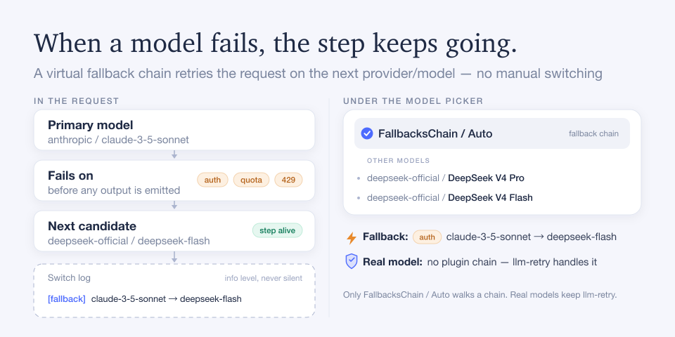
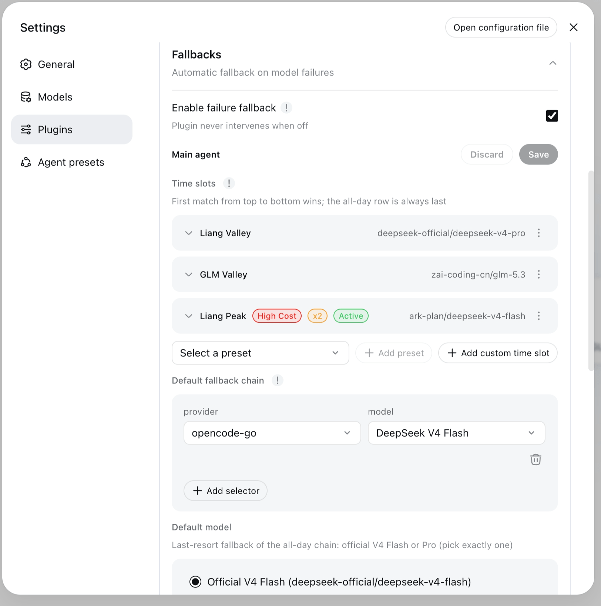

# dsh-llm-fallbacks

[English](README.md) | [Chinese](README.zh-CN.md)

[](https://www.npmjs.com/package/dsh-llm-fallbacks)
[](LICENSE)


[](https://dshfind.com/zh/plugins/omdsh-dev/dsh-llm-fallbacks?ref=badge)

Automatic provider/model fallback chains for dsh (DeepSeek Harness): a session whose model selection routes to the plugin's virtual **`FallbacksChain / Auto`** row walks a configured fallback chain — an LLM request that keeps failing on a listed code (auth, quota, rate limiting 429, …) is retried on the next available provider/model, so tasks are not interrupted by model problems. A session on any **real** provider/model has **no plugin fallback**: `llm-retry` alone handles it. Select `FallbacksChain / Auto` in the model picker to get a chain.

Works in both dsh front ends: the **web** profile (Settings → Plugins → Fallbacks card) and the **dsh-tui** terminal profile (`/fallbacks` session diagnostics, `/fallbacks config` readback, and the `/settings` fallbacks section for editing).

## Three core capabilities

### Automatic model failover

A session routed to `FallbacksChain / Auto` — the root agent, or an inheriting subagent the dispatch seam mounted on that row — walks its chain: a request that fails on a listed code **before emitting any output** is retried on the next available provider/model inside the same request, and the step stays alive. Sessions on a real provider/model get no plugin fallback at all. No manual model switching, and nothing happens until you configure content.

- **Who gets a chain**: only sessions whose model selection routes to `FallbacksChain / Auto`. That is the root agent when the row is selected, and a subagent the seam mounted there at dispatch (local backend, no explicit route on the request). A real provider/model selection — root or subagent — is left entirely to llm-retry.
- **Triggers**: `triggerCodes` (default `AUTH` / `QUOTA` / `RATE_LIMIT`) — **any** dsh failure code is accepted, including `CONTEXT_WINDOW_EXCEEDED`, which fails over to a larger-context candidate. Retryable failures (5xx, `TRANSPORT`, `TIMEOUT`, …) stay with llm-retry first; each of its retries re-enters the walk, which starts past the head that just went on cooldown.
- **Partial output is committed**: once an attempt has emitted a chunk, a later failure is **not** switched inside the request — yielded output cannot be unsent. The failure surfaces to the loop; recovery is llm-retry re-entry (a fresh walk) or the terminal error.
- **Recovery**: a failed / switched-away model is held out of selection for `cooldownMs`, and `revertPolicy: cooldown-expiry` returns to the primary model on expiry. The opt-in `recovery: half-open` mode (YAML-only) makes that return evidence-driven instead of timer-based.
- **Safety valve**: `maxSwitchesPerStep` caps switches per request walk (attempts ≤ cap + 1) — chain loops cannot amplify latency.
- **Visibility**: every switch is recorded in an info-level log line (from/to/role/reason/candidates) — no silent model switching.

→ [Automatic model failover](docs/features.md#automatic-model-failover) · [Context-window-aware fallback](docs/features.md#context-window-aware-fallback)

### Peak/valley time slots

Time slots rotate the **effective root chain** by wall-clock windows: each row carries its own fallback chain, and the first row whose window contains the current moment replaces the all-day chain for the next root request — the all-day chain stays the last resort when no row matches. Rotation is a routing seed, not a failure decision: it consumes no cooldown and leaves the failure walk (fallback switch) untouched.



Four frozen UTC+8 presets (windows are code constants; preset rows lock `tz` to Asia/Shanghai):

| Preset | Window |
|---|---|
| `liang-peak` | Monday–Friday 09:00–12:00 and 14:00–18:00 |
| `liang-valley` | every other UTC+8 time (complement of Liang Peak) |
| `glm-peak` | Monday–Friday 14:00–18:00 |
| `glm-valley` | every other time (complement of GLM Peak) |

GLM Peak and GLM Valley are offered in the card picker only when `zai-coding-cn` is configured. Custom rows take `start` / `end` (`HH:mm`, may wrap midnight) and an optional `days` list.

→ [Time slots](docs/features.md#time-slots)

### Role-based subagents

A subagent's role is declared in its dispatch prompt — the Assignment header `**Execute as**: <id>` — and it is resolved against the role ids declared in `roles.list`. Only that **declared header** delivers the child's identity: the role's `persona` is installed on the child as a system-prompt section, the child's own session gets exactly one `[role: <id>]` notice row, and its session header shows a role badge.

Role **routing** is resolved separately, in three ordered stages, first hit winning — explicit `agentPreset` → **dispatch-declared** `**Execute as**: <id>` header → rules. If the child's dispatch prompt declares `**Execute as**: <id>`, that role's persona, `[role: <id>]` notice and badge are delivered **regardless of which routing stage wins** — an earlier explicit `agentPreset` can route the child as another role while the identity carriers stay the declared header's. A child with **no declared dispatch header** gets no persona, no notice row and no role half of the badge (the model half still renders when the child has a recorded route), even when rules resolve a role for routing. Routing also decides whether the child gets a fallback chain: at dispatch the seam mounts an inheriting child on the virtual `FallbacksChain / Auto` row — local backends only, and only when the request carries no explicit `provider`/`model` route; a request that does carry one is **authorized** and never rewritten (card label `authorized`, a mounted child is labelled `injected`). A mounted child's candidates are intersected with the host allowlist when `subagent-model-selection` is enabled, and an external-backend child keeps pure inheritance — which means no chain ([host policy](docs/features.md#host-subagent-model-selection-policy-dsh-012)).

This covers an **ordinary subagent dispatch and an Agent Team teammate** (`spawn_teammate`) alike: both are children dispatched with the same header, which the model writes — the same dispatch seam, no mechanism-specific configuration.

→ [Role-based subagents](docs/features.md#role-based-subagents)

## Quick start

### Install

**Desktop / Web plugin page** — in DeepSeek Harness (the Desktop app, or a `dsh web` session) open the **Plugins** page in the sidebar, click **Add plugin**, enter the package name `dsh-llm-fallbacks`, and click **Install**; then follow the host's restart prompt. The wizard accepts a package name (= npm package name), a GitHub repo, or a local directory — a registry install needs only the package name. The GUI writes into the `web` profile, the same profile the `--profile web` flag below targets.

**CLI** — for scripted setups, or the terminal front end:

```sh
dsh plugin --profile web add dsh-llm-fallbacks      # web profile (Settings → Fallbacks card)
dsh plugin --profile dsh-tui add dsh-llm-fallbacks  # dsh-tui terminal profile
```

`dsh-tui` has no plugin page of its own, so it stays CLI-only. Pin a version with `@<version>`. A registry install fetches the **built package** (`dist/`), so nothing builds on the target machine. Registry / git / local-directory variants, uninstall, and `--dump-config` verification → [docs/install.md](docs/install.md). The plugin ships **localized metadata** (title/description for the Plugins-page detail view, English + Simplified Chinese) and an **icon** — both declared in the package (`locale/*.json` + `icon.svg`) and picked up by the host automatically.

### Configure

The plugin's settings live in a shared `fallbacks:` namespace, editable from three surfaces:

| Surface | What it is | Notes |
|---|---|---|
| **Web settings card** | Settings → Plugins → Fallbacks | Full GUI editor for the `fallbacks:` namespace; writes the shared settings document |
| **`$DSH_HOME/settings.yaml`** | `fallbacks:` section in the dsh settings document | The shared source of truth — the same file the web card writes; readable and editable everywhere, including scripted setups |
| **TUI `/settings`** | fallbacks section in the dsh-tui settings screen | dsh-tui ≥ v0.8.5; native fields for simple keys, JSON text fields for complex structures |

(`/fallbacks` and `/fallbacks config` are diagnostics — read-only views, not edit surfaces.) A minimal section:

```yaml
fallbacks:
  rootChain:               # all-day chain: leading entries = fallback walk, last = Default model (official)
    - anthropic/claude-3-5-sonnet
    - deepseek-official/deepseek-flash
  timeSlots:               # optional: rotate the effective root chain by wall-clock windows
    - kind: preset
      preset: liang-peak
      chain:
        - anthropic/claude-3-5-sonnet
  roles:                   # optional: declare role entities, then reference them from rules
    list:
      - id: reviewer
        persona: Code-review subagents
        chain:
          - openai/gpt-4o-mini
        fallback: inherit-root
    rules:                 # subagent-only: rules never match root requests
      - role: reviewer
```

Three rules of thumb:

- **There is no feature switch**: the plugin intervenes exactly when content is configured — a non-empty `rootChain`, at least one `timeSlots` row, or one declared role. An empty section is a complete no-op, and the Plugins-page row toggle is the master switch.
- **The all-day `rootChain` tail must be exactly one official model** — `deepseek-official/deepseek-flash` **or** `deepseek-official/deepseek-v4-pro` (XOR); the leading entries are the fallback walk, walked first.
- **Slots and roles are optional**: the first time-slot row whose window matches replaces the all-day chain for the next root request; rules map subagents to declared roles and never match root requests.

Full reference (keys, entry syntax, selector rules, migration) → [docs/configuration.md](docs/configuration.md).

> **Upgrade note (breaking)**: the config-level `enabled` switch is **removed** — a stored section still carrying `enabled: true/false` loads cleanly (the key is ignored and stripped on the next save), but the switch no longer gates anything. If you relied on `enabled: false` to keep the plugin inert, empty the section (or disable the plugin row on the Plugins page) instead.

### Verify

Save the config and restart the session, then type `/fallbacks` — the read-only in-session diagnostics (origin, resolved role, chain, recent fallback switches, cooldown status). In a dsh-tui profile, `/fallbacks config` reads back the composed configuration.

## Feature highlights

- **Automatic failover** on the virtual route — a `FallbacksChain / Auto` session (root or seam-mounted subagent) walks its chain on a listed failure code and the step continues; real-model sessions have no plugin fallback. → [details](docs/features.md#automatic-model-failover)
- **Context-window-aware fallback** — `CONTEXT_WINDOW_EXCEEDED` fails over to a larger-context candidate; the switch is request-scoped (no cooldown). → [details](docs/features.md#context-window-aware-fallback)
- **Peak/valley time slots** — four frozen UTC+8 presets or custom windows rotate the effective root chain. → [details](docs/features.md#time-slots)
- **Role-based subagents** — a dispatch-declared role brings persona, notice row and badge to the child; inheriting children are mounted on the virtual chain route subject to host policy. → [details](docs/features.md#role-based-subagents)
- **FallbacksChain in the picker** — select `FallbacksChain / Auto` to make the configured chain the session route; any real model is served by llm-retry alone, with no plugin fallback. → [details](docs/features.md#fallbackschain-in-the-model-picker)
- **Host subagent model policy** — the dsh 0.1.2 allowlist is a hard constraint on every plugin-originated subagent route. → [details](docs/features.md#host-subagent-model-selection-policy-dsh-012)
- **Five bundled preset roles** — `reviewer` / `scout` / `security-reviewer` / `sonic` / `task`, declared on apply. → [details](docs/features.md#preset-roles)
- **dsh-tui surfaces** — `/fallbacks`, `/fallbacks config`, and a `/settings` section with web-card parity. → [details](docs/features.md#dsh-tui-surfaces)

## Mount-only

The plugin installs as a **pure mount**: bundle insert + client inject + its own gateway channel (`/api/fallbacks/get|set|reset`) — no dsh patches, no postinstall step, and dsh upgrades never require re-patching. Stale leftover patches from an older patched install are harmless.

## Documentation

| Doc | Content |
|---|---|
| [docs/install.md](docs/install.md) | desktop/web plugin page / profile install (web + dsh-tui) / registry / git / local variants / uninstall / `--dump-config` verification |
| [docs/configuration.md](docs/configuration.md) | full `fallbacks` namespace reference, selector syntax, example YAML, plugin-config card usage, TUI readback, behavior notes, preset roles |
| [docs/features.md](docs/features.md) | capability reference: failover, context-window fallback, time slots, role-based subagents, picker, host policy, preset roles, agent presets, dsh-tui |
| [docs/repair.md](docs/repair.md) | session-log repair: refusal classes, `--apply` publishing, flags, exit codes, lossy `--drop-legacy-events` |
| [docs/consumer-api.md](docs/consumer-api.md) | developer consumption contract: library API + named `llm-fallbacks` service + role seeds, export inventory, lifecycle, typing |
| [docs/release.md](docs/release.md) | release process: Trusted Publishing setup, Release prep SOP, fragment format, rollback |
| [docs/verification.md](docs/verification.md) | verification records (test matrix, bundle layer order, runtime contracts, QA gate script) |
| [CHANGELOG.md](CHANGELOG.md) | released changes, assembled from `.changes/` fragments |

## License

Released under the **MIT** License — see [LICENSE](LICENSE). The LICENSE file is authoritative for copyright and license terms.
