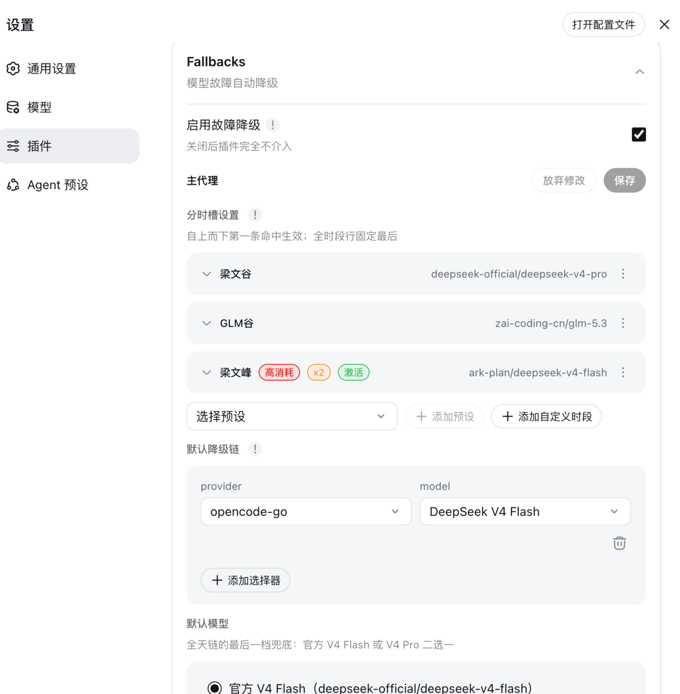

# dsh-llm-fallbacks

[English](README.md) | [中文](README.zh-CN.md)

[](https://www.npmjs.com/package/dsh-llm-fallbacks)
[](LICENSE)


[](https://dshfind.com/zh/plugins/omdsh-dev/dsh-llm-fallbacks?ref=badge)

dsh（DeepSeek Harness）的自动模型降级插件：当 root agent 或 subagent 的模型请求持续失败（重试耗尽、权限、配额超限、限流 429）时，按角色/模型 fallback 链自动切换 provider/model，当前 step/turn 在目标模型上继续完成——任务不因模型问题中断。

两个 dsh 前端均可用：**web** profile（设置 → 插件配置 → Fallbacks 卡片）与 **dsh-tui** 终端 profile（`/fallbacks` 会话诊断、`/fallbacks config` 回读，以及 `/settings` 中的 fallbacks 区块用于编辑）。

## 峰谷无忧

峰谷无忧（分时切换）按墙钟窗口轮换**生效 root 链**：每个时段槽行拥有自己的 fallback 链，第一个窗口包含当前时刻的行将在下一个 root 请求取代全时段链——无行命中时，全时段链作为兜底保持在最后。峰谷窗口因此可以使用不同的模型链，而失败降级路径（降级切换）保持不变。



四个冻结的 UTC+8 预设（窗口为代码常量；存在预设行时 `tz` 锁定 Asia/Shanghai）：

| 预设 | 窗口 |
|---|---|
| `liang-peak` | 周一至周五 09:00–12:00 与 14:00–18:00 |
| `liang-valley` | 其它所有 UTC+8 时间（Liang Peak 的补集） |
| `glm-peak` | 周一至周五 14:00–18:00 |
| `glm-valley` | 其余时间（GLM Peak 的补集） |

GLM 峰与 GLM 谷仅在已配置 `zai-coding-cn` 时出现在设置卡选择器中。

每个 root 请求时刻，第一条窗口包含当前时刻（按 `fallbacks.tz`，默认 Asia/Shanghai）的额外行生效；无行命中 → 全时段 `rootChain`——其链尾（默认模型）必须是恰好一个官方模型：`deepseek-official/deepseek-flash` 或 `deepseek-official/deepseek-pro`（二选一）。分时切换是路由种子而非失败决策：在下一个 root 请求生效、不消耗冷却、不计入 `maxSwitchesPerStep`，日志记为**分时切换**；失败降级保持**降级切换**。完整语义 → [分时槽预设（分时切换）](#分时槽预设分时切换) 与 [docs/configuration.md](docs/configuration.md)。

## 快速开始

### 安装

```sh
dsh plugin --profile web add dsh-llm-fallbacks      # web profile（设置 → Fallbacks 卡片）
dsh plugin --profile dsh-tui add dsh-llm-fallbacks  # dsh-tui 终端 profile
```

同一个插件、两个前端——区别只在 `--profile` 参数。钉版本：加 `@<version>`。registry 安装拉取的是**已构建产物**（`dist/`），目标机无需构建。registry / git / 本地目录变体、卸载与 `--dump-config` 验证 → [docs/install.md](docs/install.md)。

### 配置界面

插件的设置存在于共享的 `fallbacks:` 命名空间中，可通过三个界面编辑：

| 界面 | 是什么 | 说明 |
|---|---|---|
| **Web 设置卡** | 设置 → 插件配置 → Fallbacks | `fallbacks:` 命名空间的完整 GUI 编辑器；写入共享设置文档 |
| **`$DSH_HOME/settings.yaml`** | dsh 设置文档中的 `fallbacks:` 分节 | 共享的事实源——与 Web 卡写入的是同一个文件；任何场景（包括脚本化配置）都可读写 |
| **TUI `/settings`** | dsh-tui 设置界面中的 fallbacks 区块 | 需要 dsh-tui ≥ v0.8.5；简单键用原生字段，复杂结构用 JSON 文本字段（见 [dsh-tui profile（终端）](#dsh-tui-profile终端)） |

按你的前端选择入口：web 用户用设置卡，终端用户用 `/settings`，YAML 文件处处可用。（`/fallbacks` 与 `/fallbacks config` 是诊断命令——只读视图，不是编辑入口。）

### 最小配置

在共享设置文档（`$DSH_HOME/settings.yaml`——见 [配置界面](#配置界面)）中添加 `fallbacks:` 分节：

```yaml
fallbacks:
  enabled: true            # 功能开关——默认关闭（否则插件完全 no-op）
  rootChain:               # 全时段链：前面的条目 = 降级路径，最后一项 = 默认模型（官方模型）
    - anthropic/claude-3-5-sonnet          # 先走
    - deepseek-official/deepseek-flash  # 最后一档（Flash 或 Pro）
  timeSlots:               # 可选：按墙钟窗口轮换生效 root 链
    - kind: preset         # 冻结的 UTC+8 窗口；仅链可编辑
      preset: liang-peak   # 周一至周五 09:00–12:00 与 14:00–18:00
      chain:
        - anthropic/claude-3-5-sonnet
    - kind: custom         # 自定义窗口（可跨午夜）
      name: evening        # 可选显示名称
      start: '22:00'
      end: '02:00'
      days: [1, 5]         # 可选；缺省/空 = 每天（0=周日…6=周六）
      chain:
        - openai/gpt-4o
  roles:                   # 可选：先声明角色实体，再由规则引用
    list:
      - id: reviewer       # 唯一 id；"inherit" 为保留字
        persona: 代码审查子代理
        chain:
          - openai/gpt-4o-mini
        fallback: inherit-root   # 先走角色链，再追加继承的 rootChain
    rules:                 # 仅对子代理生效：规则不匹配 root 请求
      - role: reviewer     # 所有 subagent → reviewer 角色
```

按四个步骤逐步构建：

**1. 启用插件。** `enabled: true` 打开降级引擎。默认**关闭（`false`）**——未配置任何链时插件完全 no-op。

**2. 配置全时段 `rootChain`。** 前面的条目是降级链，请求失败时先走；**最后**一项是默认模型。

> **链尾合规**：最后一项必须是恰好一个官方模型——`deepseek-official/deepseek-flash` 或 `deepseek-official/deepseek-pro`（二选一）。设置卡与 gateway 在保存时拒绝其它尾巴；遗留的非合规尾巴启动时告警并继续按 fallback-only 走原链，但无法原样保存。已退役的 `deepseek-v4-flash` / `deepseek-v4-pro` 不再是合法链尾——已保存的 V4 尾巴现在会告警、进入惰性（分时行 + 虚拟选择器）、并在选到合法链尾前阻止保存。`deepseek-pro` 是合法选择器但其模型尚未进入目录：设置卡中显示为禁用（「暂不可用」），请求在 gateway 启用该 id 前会在 provider 处失败。插件不探测目录可用性——含 `deepseek-pro` 的链会像其它精确条目一样派发到它；在虚拟路由上由 `stream()` 委派服务生效链的第一个可派发精确链头，因此 Pro 之前有可用条目的链仍路由到更早的条目。

**3. 添加 `timeSlots`（可选）。** 各行按墙钟窗口轮换生效 root 链。预设行使用冻结的 UTC+8 窗口（仅链可编辑；存在预设行时 `tz` 锁定 `Asia/Shanghai`）；自定义行使用 `start`/`end`（可跨午夜）与可选的 `days` 列表。第一个窗口包含当前时刻的行生效；无行命中 → 全时段 `rootChain`。分时切换是路由种子——在下一个 root 请求生效、不消耗冷却（见 [峰谷无忧](#峰谷无忧)）。

**4. 添加 `roles`（可选）。** 在 `roles.list` 中声明角色实体（id、persona、chain、可选的 `fallback` 策略），再用 `roles.rules` 把 subagent 映射到角色。规则绝不匹配 root 请求——未命中规则（或 root 请求）时由内置 `inherit` 角色兜底，追加 `rootChain`。

完整参考（角色实体、fallback 策略、规则、selector、预设角色、分时槽预设）→ [docs/configuration.md](docs/configuration.md)。

> **升级提示（行为变更）**：已有 `fallbacks:` 配置若**未显式写 `enabled` 键**，升级后解析为 `false`——请补上 `enabled: true` 以保持插件继续生效。

### 验证

保存配置并重启会话，然后键入 `/fallbacks`——只读的会话内诊断（来源、解析角色、链、最近降级切换、冷却状态）。在 dsh-tui profile 中，`/fallbacks config` 回读组合配置；见 [dsh-tui profile（终端）](#dsh-tui-profile终端)。

## 修复已有会话

会话日志只能经**冻结的已发布迁移链**进入 GUI。该链在第一条无法归类的记录处即抛错，因此由旧版发行版写入的 pre-V3 日志——或由任何合并过自定义 message source kind 的插件写入的日志——会让会话加载失败，而其字节不会自行改变。以下两类覆盖了几乎所有情况，且根因同类：内容超出了某条已发布格式边界的准入范围。

| 类别 | 日志携带什么 | 根因 |
|---|---|---|
| `source-kind` | 消息的 `source.kind` 不在已发布词汇表内 | 词汇表按**格式边界冻结**：插件把自定义 kind 合并进 `MessageSourceMap` 后，V2→V3 边界会拒绝该日志（`cannot safely transform unclassified message source`）。已发布 kind 为 `user`、`plugin`、`model`、`tool`、`agent-instructions`、`session-reference`、`team-message`、`goal`、`skill-invocation`、`skill-catalog`、`coordinator`、`subagent-report`、`subagent-settled`、`webhook`、`agent-message` |
| `subagent-descriptor-version` | `subagent/descriptor` 记录的 `version: 2` | V0→V1 边界只准入 descriptor `version: 3`，而 dsh `v0.1.0-rc.7` … `v0.1.1-rc.2` 写入的是 version 2 |

第三类——遗留 `fallbacks/switch` 事件类型——**无法**通过改写修复：见 [fallbacks/switch 的有损恢复（opt-in）](#fallbacksswitch-的有损恢复opt-in)。

**如果你在编写插件：绝不要新增自定义 `source.kind`。** 持久化词汇表按格式边界冻结，自定义 kind 会让携带它的每个会话在后续 dsh 发行版中都无法读取。请改用受支持的 `plugin` 分支——`{ kind: 'plugin', plugin: '<stable-id>', form: … }`——正如 dsh 自身的 `model-selection` notice 那样；稳定 id 记录了原 kind 是什么。

### 用法

工具在本仓库内运行（clone + `pnpm install`）。其源码确实随 npm tarball 一起发布，但那里没有可运行的入口——没有注册 `bin`，且 `tsx` 是 devDependency——因此 registry 安装无法运行它。它**默认只读报告**：遍历会话根目录、把每个 pre-V3 日志归入恰好一个拒绝类别，并打印各类别计数。只有给出 `--apply` 才会写入。

```sh
git clone https://github.com/omdsh-dev/dsh-llm-fallbacks.git
cd dsh-llm-fallbacks
pnpm install
pnpm repair:session-logs                             # 只读报告（默认）
pnpm repair:session-logs -- --root ~/.dsh/sessions   # 指定会话根目录
pnpm repair:session-logs -- --apply                  # 发布修复后的后继世代
```

`--dry-run` 已不存在：报告**就是**默认模式，`--dry-run` 会作为未知参数被拒绝（exit 2）。

| 参数 | 含义 |
|---|---|
| `--root DIR` | 要遍历的会话根目录（默认 `$DSH_HOME` 或 `~/.dsh`，再退到 `/sessions`） |
| `--apply` | 运行各规则的证明，并在每个被修复的原件旁发布当前世代的后继（需要先解析出已发布 catalog） |
| `--class NAME` | 把 `--apply` 的修复范围限制为单一拒绝类别；列表、按类别表与退出码仍覆盖 `--root` 下的每个日志，且「可修复」判定始终基于**完整**策略计算，因此该参数绝不会隐藏拒绝，也不会承诺本次调用无法完成的修复 |
| `--catalog PATH` | 显式指定已发布 catalog 路径（包目录、包含它的目录，或其模块入口文件）。解析出的模块会被**执行**而非解析（与本工具自身的运行权限相同），且必须声明当前格式版本 ≥ 3；版本过低的 catalog、或归属其他包的模块文件都会被拒绝（exit 2），而不是被信任去校验自己写出的后继 |
| `--backup` | 发布前把原始世代复制为 `<name>.bak`；若本次运行最终没有发布任何内容，则会把**本次创建**的副本再删除（已存在的副本绝不会被触碰；若其字节与当前原件不同，则会阻断修复并提示该文件，直到你检查并删除它） |
| `--drop-legacy-events` | 针对遗留 `fallbacks/switch` 行的 opt-in **有损**恢复（见下） |
| `--json` | 输出机器可读报告以替代文本报告 |
| `--quiet` | 抑制逐日志行与按类别表（警告与错误永不抑制） |
| `--help`、`-h` | 打印用法文本（含 `--apply` 前置条件）并以 exit 0 退出 |

原始世代绝不会被修改、也绝不会被截断；回滚即删除已发布的后继世代，原世代重新成为 dsh 打开的世代。

**`--apply` 前置条件：仅当没有 dsh 实例正在写入 `--root` 下的会话时才可运行。** 发布器把后继世代链接进会话目录时**不观察宿主的 flock 租约**（该租约是宿主内部的，本仓库无法取得），因此仍在向旧世代追加写入的 dsh 会在宿主改用后继世代后被孤立。请先停止 dsh。

**运行时下限：Node ≥ 22.15。** 读取与写入需要 `node:zlib` 的 zstd（该版本引入；`engines.node` 允许 `>= 22`）；更旧的运行时会 fail-closed 并给出可操作的提示，而不是模块链接堆栈。

**两种策略，以及 `ok-truncated`。** 日志的类别与 `ok` 来自**宿主加载器**的策略——即决定 GUI 能否打开该会话的策略——但该策略可能吞掉一次拒绝并丢弃其后的所有行。因此每个 `ok` 日志都会用**同一加载器策略在严格恢复下**复核（只差 recovery 这一个维度，因此那里的拒绝意味着确实丢行，而不是“形状不是当前格式”）：若该复核拒绝，则报告为 **`ok-truncated`**（`--json` 中的 `strictRefusal` 原因、summary 中的 `ok-truncated` 计数），因为该会话是在**缺少**被吞掉的那些行的情况下打开的。这类会话仍以 `0` 退出——它们确实能加载。

**发现阶段绝不 fail-open。** 无法读取的命名空间/会话目录、**低于格式下限**的作为符号链接或非普通文件的规范世代、以及残留的 `session.repair.*.jsonl.zstd.tmp`，都会被**报告**（`skipped`/`staleStagingFiles` 条目，始终打印，不会被 `--quiet` 隐藏）、抑制 “no session log …” 行，并使运行以 `1` 退出。符号链接只报告、绝不跟随：修复会在其目标旁写入，而写入必须留在 `--root` 内。无法读取的 `--root` 是致命错误（exit 2），而绝不是一份空报告。

**`--apply` 拒绝发布它不是基于其解码的那一版。** 本次运行读取到的字节摘要会在暂存任何内容之前与文件比对，因此并发追加会在首次写入前被拒绝。若源文件在本次运行**创建**的后继发布之后发生变化，该后继会被移除；若是在接受一个已存在的相同后继之后发生变化，失败信息会指出该文件并说明需删除它以回滚——绝不会说 “nothing was published”。

**退出码**：`0` = 每个日志都能加载（在严格策略下会丢行打开的会话报告为 `ok-truncated`，仍以 `0` 退出）；`1` = 至少一个日志仍被拒绝/不可修复、修复失败、有日志未发布（包括被 `--class` 排除的）、某个输入无法被检查（`skipped` 路径），或发现残留的 `session.repair.*.jsonl.zstd.tmp`；`2` = 致命错误（参数非法、缺少或无法读取 `--root`、`--apply` 未解析出 catalog、catalog 低于格式 v3、`--apply --drop-legacy-events` 缺少 `--backup`，或运行时没有 `node:zlib` zstd）。

### fallbacks/switch 的有损恢复（opt-in）

0.2.2 之前的版本会写入 durable `fallbacks/switch` 会话事件（issue #52：apply() 时的注册无效，因为插件与宿主解析到不同模块实例）。冻结的 V0→V1 边界**即使该行带 `ignorable: true` 也**拒绝该事件类型，因此没有任何改写能让这样的行加载——删除是本仓库内唯一的恢复方式。选择 opt-in 意味着接受两个后果：

1. **该会话记录的 provider/model 切换审计行会被删除。** 它们此后只存在于原始世代中（使用 `--backup` 时还有其 `.bak`）：已发布的后继世代是唯一缺少它们、却可读的世代。
2. **幸存事件会被重新编号。** 同一边界要求每个事件的 `seq` 等于其运行中的事件计数，因此每个幸存事件都会取得它在幸存事件流中的位置所对应的 `seq`，它携带的每个 Session-seq 引用也随之一并平移。除此之外内容逐字节不变。

```sh
pnpm repair:session-logs -- --drop-legacy-events                   # 报告：统计将被删除的行
pnpm repair:session-logs -- --drop-legacy-events --apply --backup  # 此处必须带 --backup
```

该模式**默认关闭**，报告模式不写任何文件，且 `--apply --drop-legacy-events` **必须带 `--backup`**（否则 exit 2）。以下情况 fail-closed、不写任何文件：幸存行引用了将被删除的 seq、源行的编号不稠密、或重新编号会跨越头部的种子切点。`--json` 会按日志报告 `legacyEventCount`（源日志中的遗留行数）、`droppedEventCount`、`renumberedEventCount` 以及机器可读的 `lossyRefusal` 原因；文本模式把 dropped/renumbered 计数作为醒目警告打印。其它名字的未知事件类型永不删除——这类日志保持不可修复。不加该参数时，这些会话按设计保持不可读，字节原样保留。

持久修复属于上游迁移边界（让冻结的 V0→V1 边界准入它曾发行的 descriptor 版本，并让自定义 message source kind 迁移到 `plugin` 分支）。

## 能力一览

- **root / subagent 自动降级**：任意 agent 在模型故障下按链切换到下一个可用 provider/model，无需手动换模型。
- **两块制配置**：`rootChain` 管 root 代理；声明式角色实体（`roles.list`）供 `roles.rules` 引用（或内置 `inherit`）。
- **选择器里把链当主模型**：`enabled` 开启时，宿主模型选择器（web 与 TUI 一致）出现虚拟 `FallbacksChain` / `Auto` 行——选中它即以配置的链作为 root 主模型（需要 all-day 链头合规才能成功委托）；选真实模型则保持 fallback-only（见 [模型选择器中的 FallbacksChain](#模型选择器中的-fallbackschain)）。
- **峰谷无忧（分时切换）**：可选的 `fallbacks.timeSlots` 行按墙钟窗口（配置级 `tz` 时区，默认 `Asia/Shanghai`）轮换 root 生效链——四个冻结的 UTC+8 预设（`liang-peak` / `liang-valley` / `glm-peak` / `glm-valley`，窗口为代码常量、仅模型链可编辑），或自定义 `start`/`end`/`days` 窗口。第一条命中的行生效；全时段行固定最后。时段切换在**下一个** root 请求生效，日志记为**分时切换**——路由种子而非失败决策：不消耗冷却、不计入 `maxSwitchesPerStep`。失败降级保留**降级切换**文案（见 [分时槽预设（分时切换）](#分时槽预设分时切换)）。
- **派发时角色解析**：在 subagent 的首次请求上，其角色按三个阶段解析——显式（`agentPreset` 匹配已声明角色 id）→ 确定性规则（匹配记录 pair 或实际服务的链头——见 [模型选择器中的 FallbacksChain](#模型选择器中的-fallbackschain)）→ LLM 自动匹配（从已声明角色体系中选择，`fallbacks.roleAutoMatch` 默认 `true`）。解析出的角色的链头模型注入首次请求，并以显式 `role → model` 日志行记录（不写 durable `fallbacks/switch` 事件——issue #52 停写）；设 `roleAutoMatch: false` 仅关闭 LLM 自动匹配阶段（显式 `agentPreset` 阶段仍生效——无显式角色时即复现原有仅规则行为）。设置卡总是渲染「启用角色自动匹配」开关（默认 `true`）以切换之——即使是从未声明过该键的旧配置，schema 默认值同样生效。
- **角色人格注入到子代理（与链无关）**：当 subagent 的派发声明了本插件已知的角色（Assignment 的 `**Execute as**: <id>` 字段）时，该角色的 `persona` 会安装为子代理自身的人格——角色就是子代理的身份，而不只是路由决策；注入与路由无关：`chain` 为空的角色与带链角色的人格注入完全一致（链只负责选模型）。调用方已设置的人格永不覆盖；宿主 provider 无法承载人格时跳过注入，派发照常原生运行。
- **角色在子代理自己的会话中声明**：声明了角色的派发会让子代理自身的会话得到恰好一条插件 notice 行，写明它被派发为哪个角色——`[role: <id>]`，当角色声明了人格但被跳过时追加 ` (persona not applied)`——在子代理首个非空 pre-step 写入一次，root 会话以及 `inherit`/未解析角色的派发永不写入。该行是持久轨迹行，子代理结束后角色仍可在其会话中读到。
- **子代理角色徽标**：当 subagent 被**声明了角色地派发**——即其 Assignment 中的 `**Execute as**: <id>` 字段，也就是承载人格的同一处声明，并且是徽标的**唯一**来源（策略开或关皆同）——时，其会话在 Web 会话头部的标题旁显示一个紧凑的角色徽标；悬停显示 `role → 最近一次请求的路由`（最近一条已记录请求的路由，而非派发时的路由）。由于只读取被声明的头部字段，通过其他阶段解析出角色（`agentPreset` 匹配、role 规则或 LLM 自动匹配）但**未**在 Assignment 头部声明角色的子代理仍会按该角色路由，却**不**显示徽标——徽标绝不报告事后推断的角色。`inherit`/未解析角色的会话不显示徽标。徽标是持久的：它读取子代理自身的会话记录，因此**已结束的子代理会话**与**宿主重启之后**仍然显示。
- **上下文窗口感知降级**：`triggerCodes` 接受任意 dsh 失败码，包括 `CONTEXT_WINDOW_EXCEEDED`——请求超出当前模型上下文时，降级到上下文窗口**更大**的候选（装不下的候选被跳过）；由于路由本身健康，该切换是请求级的：不冷却、不浪费半开探针（见 [降级触发码](#降级触发码triggercodes)）。
- **冷却与回主**：被切离/失败的模型在冷却期内不再入选；`revertPolicy: cooldown-expiry` 冷却到期后自动回主模型。
- **宿主子代理模型策略（dsh 0.1.2）**：当宿主 `subagent-model-selection` 策略启用时，其允许列表对每个插件发起的 subagent 路由都是硬约束——显式授权的派发路由保持为链头（跳过角色注入），继承注入的链头与失败切换目标都与生效允许列表求交集，交集为空则跳过注入/切换（warn 日志 + 只读卡片警告；绝不发送允许列表之外的请求）。策略存在但不可读时 fail-closed。策略关闭/缺省时，注入与失败切换的选择与 0.3.5 完全一致。覆盖路径上的 `reasoningEffort` 遵循上游 routeChanged 规则（同路由 → 保留；跨路由 → 除非显式指定否则丢弃）。见 [宿主子代理模型策略](#宿主子代理模型策略dsh-012)。
- **半开恢复（可选）**：`recovery: half-open` 让恢复以证据驱动——冷却到期后路由进入 **half-open**，以一次记录探针（logged probe）放行，而不是直接恢复首选；连续失败使抑制时长按 **×2** 逐次升级、**1 小时**封顶；观察到完成即闭合回路、完全恢复首选。`revertPolicy: 'never'` 使该机制完全失效；状态为会话级内存态（重启即重置）。仅 YAML 配置——默认 `timer` 保持所有既有行为逐字节一致（见 [docs/configuration.md](docs/configuration.md#recovery-mode-recovery-key)）。
- **行为可见**：每次切换以 info 级日志行（from/to/role/reason）记录——无静默换模型。插件**刻意不写** durable `fallbacks/switch` 会话事件（issue #52——apply() 时的事件类型注册被证伪无效，含该事件的会话在 dsh 重启后拒绝加载）。由旧版插件写入、含此类事件的会话**无法**通过 `ignorable` 标记修复——已发布的 session-format 迁移链（v0→v1）即使事件带 `ignorable` 也拒绝未知事件类型——因此 `pnpm repair:session-logs` 会报告此类日志（只有显式 opt-in 的有损 `--drop-legacy-events` 才会恢复它们——见 [修复已有会话](#修复已有会话)）。
- **安全阀**：`maxSwitchesPerStep` 限制每 step 切换次数、`alwaysModeRetryCap` 限制 always 模式重试——链循环不会放大延迟。
- **无配置回归（no-op）**：未配置任何链时行为与未安装插件完全一致——`enabled` 默认关闭（见 [最小配置](#最小配置)）。

## dsh-tui profile（终端）

在 dsh-tui profile 中，插件有三个操作面——职责严格区分：

- **`/fallbacks`** —— 本次会话发生了什么：来源、解析角色、生效链、最近降级切换、冷却状态（`recovery: half-open` 生效时显示 half-open 标记行）。只读。
- **`/fallbacks config`** —— 配置了什么：组合配置回读（触发码、根链、分时槽、时区、角色、角色规则、冷却、回主策略、安全阀、预置、角色自动匹配）。除唯一的动作命令 **`/fallbacks config revert-seed <role-id>`** 外只读——该命令把某个 seed 角色的 persona 还原为已声明的默认（Web 设置卡将 seed 角色的 persona 呈现为只读、不提供还原入口，此命令是该动作的唯一入口）。
- **`/settings`** —— 编辑界面。插件注册 **fallbacks** 区块，与 **Web 设置卡完全一致**：布尔（`enabled`、`roleAutoMatch`）渲染为开关、下拉（`presets`、`revertPolicy`）为选择器、数值（`cooldownMs`、`maxSwitchesPerStep`、`alwaysModeRetryCap`）为数字输入；复杂结构（`rootChain`、`timeSlots`、`roles.list`、`roles.rules`）为 JSON 文本字段，`triggerCodes` 为逗号分隔文本字段。非法草稿（JSON 解析失败、链尾不合规、分时行畸形）会阻止保存——区块绝不写入损坏配置。

**版本要求**：`/settings` 的 fallbacks 区块需要 **dsh-tui ≥ v0.8.5**（`main` 上 commit `c51661f` 及以后；settings seam 于 v0.8.0 引入，groups 结构与校验于 v0.8.5 引入）。更旧的 dsh-tui 没有该区块，文件编辑仍是 TUI 唯一编辑面。

文件编辑在任意情况下仍然可用：全局设置写共享的 `$DSH_HOME/settings.yaml`（`fallbacks:` 分节——与 Web 卡写的是同一个文件）；dsh-tui 专属覆盖写 profile patch `~/.dsh/profiles/dsh-tui/cordis.patch.yml`（插件行上的 `config:` 覆盖）。注意：patch 行会**整体替换**目标行的整个 `config`——想保留的字段都要写全（schema 默认值补齐其余）。

## 模型选择器中的 FallbacksChain

当 `enabled: true` 时，插件注册一个虚拟 provider **FallbacksChain**，目录中只有一行：**Auto**。web profile 与 dsh-tui 都能看到这一行：两者共享同一个 adapter catalog，无需设置页接线或宿主补丁（它与 `/settings` 的 fallbacks 区块相互独立——区块编辑的是配置，不是选择器目录）。该行只要插件启用就可见——遗留多模型或空的 all-day 链**不会**隐藏它（只是委托会拒绝服务）。

选择 **FallbacksChain / Auto** = 把配置的链作为 root **主模型**：请求保留在虚拟对上，由 adapter 的薄委托在请求时刻派发到生效链的第一个精确 `provider/model`，失败后由降级引擎从该链头照常沿链切换。之所以让选择原样下发（而不是把路由改写成链头），也正是为了不让宿主的模型变更提示被反复触发：落盘的路由与会话选择一致，因此该提示只在**选择真的发生变化**时出现一次，而不再每一步重新注入。选择任何真实目录模型则保持 v0.2.2 的 fallback-only 行为——会话模型为主，链只在它失败后介入。

**没有 `rootMode` 开关**——没有配置键、YAML 字段、设置开关或 gateway 标志。模式就是会话的 `{provider, model}` 选择本身：`FallbacksChain` = 链为主模型；任意真实模型 = fallback-only。

注意：

- **选择器文案**：目录行的 `name`（composer 触发器显示）是动态的——`Auto: DeepSeek Flash[Liang Peak]` / `Auto: DeepSeek Flash[all-day]`（用 catalog 显示名，不是 model id）；id 仍是 `Auto`。all-day 尾巴不合规则只显示 `Auto`。重新打开选择器即可刷新。
- **全来源同一个薄委托**：root 代理与继承了该选择的 subagent 会话由同一个 `stream()` 薄委托服务——subagent 的角色解析与注入语义不变，只有一处刻意的放宽：派发时规则匹配接受**记录 pair 或实际服务的链头**（此前匹配的超集，因此以真实链头为键的规则仍能命中），虚拟行绝不是第二个路由引擎。继承了该选择的 subagent 仍经链头路由。
- **链尾合规门槛**：委托成功要求 all-day 链**尾巴合规**——最后一项必须是恰好一个官方模型（`deepseek-official/deepseek-flash` 或 `deepseek-official/deepseek-pro`，即设置卡的「默认模型」面板）；前面的默认降级链先走。禁用插件后该行隐藏（slot/链编辑不会触发注册抖动）。
- **过期选择**：行消失（插件禁用）而会话仍选中 `FallbacksChain / Auto` 时，会话继续把它显示为当前模型，但 `routable: false`——从目录选一个真实模型即可继续（宿主原生目录语义）。
- **能力与重试策略跟随链头**：该行的模型元数据（上下文窗口、模态、推理）镜像当前生效链头，`providerRetryPolicy` 返回**该链头的**策略——因此用户配置的 `llm-deepseek.retryPolicy` 在这条路由上同样生效，不再退回宽松默认。宿主在注册时一次性捕获该策略，因此之后修改策略、或分时槽导致链头 provider 轮换，都只有在插件重新注册后才会反映。重试事件按虚拟 provider 记账——即运行时实际看到的路由。完整语义 → [docs/configuration.md](docs/configuration.md)。

## 分时槽预设（分时切换）

峰谷无忧在[首页专题](#峰谷无忧)中介绍，本节是完整参考。分时槽行按墙钟窗口轮换**生效 root 链**——适合按峰谷切换模型，且不会把墙钟轮换误认为故障降级。文案严格区分：时段轮换的日志与 UI 用**分时切换**；失败降级保持**降级切换**；会话内「模型已降级」提示只出现在失败路径。

- **匹配顺序**：每个 root 请求时刻，第一条窗口包含当前时刻（按 `fallbacks.tz`，默认 `Asia/Shanghai` / UTC+8）的额外行生效——该行的模型链**取代**全时段链；无行命中则用全时段 `rootChain`。全时段行固定最后且**必选**：最后一项必须是恰好一个官方模型（Flash 或 Pro；前面的降级条目先走）。
- **预设**（冻结，不可编辑窗口）：`liang-peak` = 周一至周五 09:00–12:00 **与** 14:00–18:00；`liang-valley` = 其它所有 UTC+8 时间；`glm-peak` = 周一至周五 14:00–18:00；`glm-valley` = 其余时间。一个预设 id 对应一行；设置卡的选择器不会重复提供已添加的预设。
- **自定义行**：`start` / `end`（`HH:mm`，可跨午夜）+ 可选 `days`（0=周日…6=周六；缺省/空 = 每天）+ 模型。
- **下一请求生效**：时段边界跨越绝不打断进行中的 step——新行在下一个 root 请求生效。轮换仅挂载生效：info 日志 + 设置卡/`/fallbacks` 状态行，无 durable 切换事件。
- **设置卡**：主代理区块下分三块——**分时槽设置**（额外行：添加预设 / 添加自定义 / 删除 / 按钮或**拖拽**排序；预设行只读展示窗口摘要、仅可编辑模型链；自定义行带可编辑名称；**时区选择器**在此区块内，只要存在预设行就**锁定 Asia/Shanghai**——预设窗口是冻结的 UTC+8 常量）、**默认降级链**（all-day 链，可配置的 provider/model 选择器列表）与**默认模型**（官方 Flash | Pro 二选一链头）。行可折叠为「名称 + 首个模型」。没有 `timeSlots.enabled` 总开关（添加行即开启），也没有 `rootMode` 控件。

## 预设角色（Preset roles）

插件内置 **5 个通用子代理角色**，开箱即用——`reviewer` / `scout` / `security-reviewer` / `sonic` / `task`——`apply` 时自动以 seeded `roles.list` 行（`{ id, persona }`）声明：幂等，且绝不覆盖 operator 同名 persona。它们以只读行的形式出现在设置卡中（每行带来源徽标，id 与 persona 均不可在卡内编辑），并出现在 `/fallbacks config` 的角色摘要中，可直接被 `roles.rules` 引用。（`designer` 与 `librarian` 不再内置：早期版本保存的行保留其 persona，现在只有在没有任何生产者仍声明其 id 时才显示 source `user` 并成为普通可编辑行——尽管 operator 并未写过这些行；伴随插件仍在声明的行会继续保持 seeded 只读状态，source 为未命名时的 `external`，或其已注册集合名。）

- **开关**：`fallbacks.presets`——`'bundled'`（默认）在 apply 时声明预设角色；`'none'` 关闭自动声明（已物化行保留）。
- 完整语义（升级行为、冲突处理、`presetRoles` 库复用）→ [docs/configuration.md](docs/configuration.md)。

## 降级触发码（`triggerCodes`）

`fallbacks.triggerCodes` 是一份 dsh 失败码列表，**任何**宿主可上报的失败码都被接受——不限于三个默认值（`AUTH` / `QUOTA` / `RATE_LIMIT`）。未列出的失败码原样透传给 llm-retry 或原始错误，与未安装插件完全一致。可重试型失败（5xx / `TRANSPORT` / `TIMEOUT` / `EMPTY_RESPONSE`）无需额外条目：llm-retry 先行退避，预算耗尽后同样进入链决策。

### 上下文窗口超限（context-window）

请求超出模型上下文窗口时，上报的失败码是 `CONTEXT_WINDOW_EXCEEDED`——dsh 内核对 provider 400 "maximum context length" 的规范码。它不是可重试码，需显式列出，才能降级到上下文更大的模型：

```yaml
fallbacks:
  enabled: true
  triggerCodes:
    - AUTH
    - QUOTA
    - RATE_LIMIT
    - CONTEXT_WINDOW_EXCEEDED  # 请求装不下时降级
  rootChain:
    - anthropic/claude-3-5-sonnet          # 先走
    - deepseek-official/deepseek-flash  # 兜底（Flash 或 Pro）
```

**顺序——降级先于压缩。** 只要 `triggerCodes` 含 `CONTEXT_WINDOW_EXCEEDED`，本插件的 `agent/request-error` 监听就会**先于**宿主压缩插件处理该拒绝：首次超限即把会话切到 fallback 模型，上下文完全不会被压缩。若更希望先尝试压缩，就不要把该码列入 `triggerCodes`。

**请求级切换。** 上下文超限说明**这一次请求**太大，而不是路由不健康。此类切换是**请求级（request-scoped）**：from 路由仍记入本 step 的失败集合（本 step 不会立刻弹回该模型）、仍计入 `maxSwitchesPerStep`，但**不**进入 `cooldownMs` 冷却、也不累加半开恢复计数器——下一条更短的提示词照常走主模型，不会在从未故障的路由上浪费一次半开探针。其余触发码一律保持**路由级（route-scoped）**（冷却 + 恢复记账），与既有行为一致。

**装不下的候选被跳过。** 上下文超限走链时，凡是已知上下文窗口不大于失败模型的候选一律跳过——从 128k 模型降到 8k 只会再失败一次。窗口取自宿主模型目录：目录行自带 `contextWindow` 时取之，否则取 `llm.resolveModelInfo(provider, model)` 的 `context.contextWindow`。两处都未公开窗口的模型保留为候选，因此缺少容量元数据的 provider 绝不会把链清空。被跳过的候选在切换日志行中标注 `skipped: context-window`。

## 宿主子代理模型策略（dsh 0.1.2）

dsh 0.1.2 为 subagent 增加了宿主侧的子模型选择：`subagent-model-selection` 设置允许列表、每会话的 `subagent/model-selection-policy` 事件、派发时的 `provider/model/reasoning_effort` 路由。插件在单一运行时仲裁点下与之协调——插件的角色/链仍是宿主不提供的失败恢复层。

**策略读取（按会话）**：会话 `subagent/model-selection-policy` 事件优先；否则读取 `subagent-model-selection` 设置服务（`enabled` 时）。服务缺失 / `enabled: false` / 无事件 → 策略关闭。

策略**启用**时：

- **授权链头保留（跳过注入）**：以显式 `provider`+`model` 派发的 subagent（派发 options、durable `request/header`、或 `model/selection` 选择）将该路由保持为链头——跳过角色注入，授权路由在首次请求上绝不被覆盖；插件链仅从失败时刻起生效。纯继承（无显式选择字段）**不是**授权路由。
- **允许列表约束注入**：纯继承仍走三阶段角色解析，但注入的链头由插件发起、必须在生效允许列表内——按序取第一个已解析且在列表内的候选。交集为空 → 跳过注入，保留宿主种子路由（warn 日志）。
- **允许列表约束失败切换**：触发码失败后，已解析候选（通配符已展开；冷却 / 本步已失败 / 与当前相同等过滤已应用）按走链顺序与允许列表求交集。交集为空 → **不切换**、不发送允许列表之外的请求，记 warn 日志 + 内存态 blocked-attempt 记录（不写 durable 会话事件——issue #52 不变）。
- **Fail-closed**：策略事件存在但载荷畸形，或设置启用但路由列表不可读 → 该会话的插件注入与切换全部禁用（warn 日志）；宿主种子与非切换行为不受影响。
- **卡片状态区（只读）**：Fallbacks 卡片的子代理区块显示生效允许列表、生效链头及其来源（`宿主授权` / `插件注入`），以及切换被阻止时的空交集警告——与运行时使用的是同一份数据，绝不是第二个写入面。
- **虚拟路由例外**：显式指定插件虚拟 provider（`FallbacksChain` / `Auto`）派发的 subagent，即为该路由的用户授权（spec D2——显式选择）。虚拟 adapter 将其请求内部委托给配置的生效链头，是该路由的既定用途，不属于 D1 的选择语义——D1 约束的是插件做出的 provider/model 选择，而不是显式所选虚拟路由内部的委托——被委托的链头不经允许列表过滤。

策略**关闭或缺省**时，注入与失败切换的**选择**与 0.3.5 一致（无允许列表过滤、无授权路由跳过）。

**Effort 规则（与策略无关）**：所有覆盖路径（角色注入、失败切换、always 上限切换）上的 `reasoningEffort` 遵循上游 0.1.2 的 `routeChanged` 规则——provider+model 路由不变则保留种子 effort；路由变化且未显式指定 effort 则丢弃（显式指定的 effort 永远保留）。陈旧的 effort 绝不会被带入另一个 provider。

完整语义 → [docs/configuration.md](docs/configuration.md#host-subagent-model-selection-dsh-012)。

## 纯挂载（零 dsh 修改）

插件以**纯挂载**方式安装：bundle 行插入 + client inject + 自有 gateway 通道（`/api/fallbacks/get|set|reset`）——无 dsh 补丁、无 postinstall 步骤，dsh 升级永不需重打。旧版打补丁安装遗留的补丁无害。

## 文档

| 文档 | 内容 |
|---|---|
| [docs/install.md](docs/install.md) | profile 安装（web + dsh-tui）/ registry / git / 本地目录变体 / 卸载 / `--dump-config` 验证 |
| [docs/configuration.md](docs/configuration.md) | `fallbacks` 命名空间全字段、selector 语法、示例 YAML、插件配置卡使用、TUI 回读、行为说明、预设角色 |
| [docs/consumer-api.md](docs/consumer-api.md) | 开发者消费契约：库 API + 具名 `llm-fallbacks` service + 角色 seeds、导出清单、生命周期、类型说明 |
| [docs/release.md](docs/release.md) | 发布流程：Trusted Publishing 前置、Release prep SOP、fragment 格式、回滚 |
| [docs/verification.md](docs/verification.md) | 验证记录（测试矩阵、bundle 层序、运行契约、QA gate 剧本） |

## 许可

本项目以 **MIT** 许可证发布，全文见 [LICENSE](LICENSE)。版权与许可条款以 LICENSE 文件为准。
